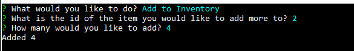

# Bamazon Node App

## Overview
Amazon-like storefront with the MySQL. 

## App Specifications
### Bamazon Customer
* App displays all products
* App asks users what product they want to buy and how many.
* App updates store quantity and informs user the total cost of purchase

### Bamazon Manager
* App gives the user the following options:
    * View Products for Sale
    * View Low Inventory    
    * Add to Inventory
    * Add New Product
    
### Bamazon Supervisor
* App gives the user the following options:
   * View Product Sales by Department
   * Create New Department

## NPM Packages Used
*   inquirer
*   mysql
*   cli-table
*   clear
*   chalk
*   dotenv

## Examples
### Screenshots
Customer - Buy Product

Manager - Options

Manager - View Products

Manager - View Low Inventory

Manager - Add to Inventory

Manager - Add Product

